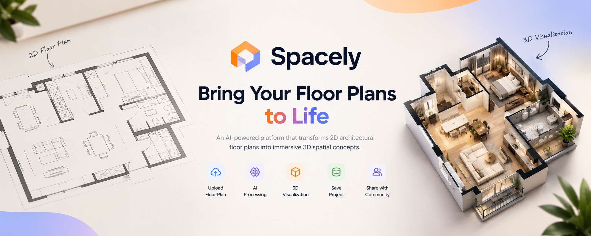

<p align="center">
  
</p>

<h1 align="center">Spacely</h1>

<p align="center">
  <strong>Bring Your Floor Plans to Life.</strong>
</p>

<p align="center">
  An AI-powered platform that transforms 2D architectural floor plans
  into immersive 3D spatial concepts.
</p>

<p align="center">
  <a href="https://github.com/priyxnshutiwari/spacely">
    
  </a>
  <a href="https://github.com/priyxnshutiwari/spacely">
    
  </a>
  
  
</p>

---

## 🏠 About Spacely

Spacely is an AI-powered interior visualization platform designed to bridge the gap between **architectural floor plans and visual understanding**.

A traditional 2D floor plan can be difficult to visualize, especially for users without architectural or interior-design experience. Spacely takes a floor plan and transforms it into an AI-generated spatial concept, helping users better understand how the planned space could look in a realistic environment.

> **From a 2D floor plan to a spatial concept.**

---

## ✨ Features

- 📐 **Floor Plan Upload**  
  Upload a 2D architectural floor plan directly into the application.

- 🤖 **AI-Powered Visualization**  
  Use AI to transform the uploaded floor plan into a visual spatial concept.

- 🏠 **3D Interior Rendering**  
  Generate realistic interior visualizations based on the architectural layout.

- 🔐 **Authentication**  
  User authentication powered through Puter.

- ☁️ **Cloud Storage**  
  Store source floor plans and generated visualizations.

- 💾 **Project Management**  
  Save and access generated spatial concepts.

- 🌐 **Community**  
  Share designs and explore spatial concepts created by other users.

---

## 🔄 How It Works

```text
             ┌───────────────────┐
             │   Upload Floor    │
             │       Plan        │
             └─────────┬─────────┘
                       ↓
             ┌───────────────────┐
             │   AI Processing   │
             └─────────┬─────────┘
                       ↓
             ┌───────────────────┐
             │ 3D Visualization │
             └─────────┬─────────┘
                       ↓
             ┌───────────────────┐
             │   Save Project   │
             └─────────┬─────────┘
                       ↓
             ┌───────────────────┐
             │     Community    │
             └───────────────────┘
```

### 1. Upload

The user uploads a 2D architectural floor plan.

### 2. AI Processing

Spacely processes the uploaded floor plan and prepares it for AI-powered visualization.

### 3. 3D Visualization

The system generates a realistic spatial concept based on the architecture and layout of the floor plan.

### 4. Save

The source floor plan and generated visualization can be stored for future access.

### 5. Community

Users can share their spatial concepts and explore designs created by other users.

---

## 🛠️ Tech Stack

| Technology | Purpose |
|---|---|
| **React** | Frontend user interface |
| **TypeScript** | Type-safe application development |
| **Vite** | Development and build tooling |
| **Tailwind CSS** | UI styling |
| **React Router** | Application routing |
| **Puter.js** | Authentication, cloud storage and AI services |
| **JavaScript** | Client-side functionality |
| **Docker** | Containerization |

---

## 🏗️ Architecture

```text
┌─────────────────────────────┐
│           User              │
└──────────────┬──────────────┘
               │
               ↓
┌─────────────────────────────┐
│      React Frontend         │
│     TypeScript + Vite       │
└──────────────┬──────────────┘
               │
               ↓
┌─────────────────────────────┐
│       Spacely Logic         │
│     AI + Project Actions    │
└──────────────┬──────────────┘
               │
       ┌───────┴────────┐
       ↓                ↓
┌──────────────┐  ┌──────────────┐
│   Puter.js   │  │ AI Rendering │
│ Auth/Storage │  │    Engine    │
└──────────────┘  └──────┬───────┘
                         │
                         ↓
                 ┌──────────────┐
                 │ 3D Spatial   │
                 │ Visualization│
                 └──────────────┘
```

---

## 📁 Project Structure

```text
Spacely/
│
├── app/
│   ├── app.css
│   ├── root.tsx
│   └── routes.ts
│
├── components/
│   ├── Navbar.tsx
│   └── Upload.tsx
│
├── lib/
│   ├── ai.action.ts
│   ├── constants.ts
│   ├── puter.action.ts
│   ├── puter.hosting.ts
│   ├── puter.worker.js
│   └── utils.ts
│
├── public/
│   ├── favicon.ico
│   └── spacely-banner.png
│
├── Dockerfile
├── package.json
├── package-lock.json
├── react-router.config.ts
├── tsconfig.json
└── vite.config.ts
```

---

## 🚀 Getting Started

### Prerequisites

Make sure you have the following installed:

- [Node.js](https://nodejs.org/)
- npm
- Git

### Clone the Repository

```bash
git clone https://github.com/priyxnshutiwari/spacely.git
cd spacely
```

### Install Dependencies

```bash
npm install
```

### Environment Variables

Create a `.env` file in the root directory:

```env
VITE_PUTER_WORKER_URL=your_worker_url
```

You can use `.env.example` as a reference.

> ⚠️ **Never commit your `.env` file or expose private API keys and credentials.**

### Run the Development Server

```bash
npm run dev
```

The application will be available at the local development URL provided by Vite.

---

## 📸 Screenshots

### Landing Page

_Add your Spacely landing-page screenshot here._

### Floor Plan Upload

_Add your upload-page screenshot here._

### AI Visualization

_Add your generated 3D visualization screenshot here._

### Community

_Add your community-page screenshot here._

---

## 🎯 Problem Statement

Architectural floor plans provide accurate information about room layouts, dimensions, and spatial organization. However, they can be difficult for non-technical users to interpret and visualize as actual spaces.

Traditional visualization workflows may also require specialized software, technical knowledge, and additional time.

Spacely addresses this problem by providing an AI-assisted approach to spatial visualization through a simple web interface.

---

## 💡 Solution

Spacely allows users to upload a 2D floor plan and generate an AI-powered visual representation of the space.

The platform combines:

- Architectural floor plans
- AI-powered image generation
- Cloud storage
- User authentication
- Project management
- Community sharing

into a single web application.

---

## 🌟 What Makes Spacely Different?

Spacely focuses on making architectural visualization more accessible by reducing the gap between **technical floor plans and visual understanding**.

Instead of requiring users to manually create a 3D model, Spacely provides an AI-assisted workflow that converts the initial architectural concept into a visual representation.

---

## 🔮 Future Scope

Future versions of Spacely could include:

- 🧠 Improved architectural layout understanding
- 🪑 Automatic furniture placement
- 🎨 Multiple interior design styles
- 🎛️ Interactive customization
- 🏠 Interactive 3D environments
- 📱 Augmented Reality visualization
- 👥 Real-time collaborative design
- 💬 Enhanced community interactions
- 📏 Better dimensional and spatial accuracy
- 🏗️ Integration with professional architectural tools

---

## 📚 References

- React Documentation — https://react.dev/
- TypeScript Documentation — https://www.typescriptlang.org/docs/
- Vite Documentation — https://vite.dev/
- Tailwind CSS Documentation — https://tailwindcss.com/docs
- React Router Documentation — https://reactrouter.com/
- Puter.js Documentation — https://docs.puter.com/

---

## 👨‍💻 Author

### Priyanshu Tiwari

**B.Tech Computer Science & Engineering**

<a href="https://github.com/priyxnshutiwari">
  GitHub
</a>

---

## 📄 License

This project is currently developed for **educational, academic, and portfolio purposes**.

---

<p align="center">
  <strong>Spacely — Bring Your Floor Plans to Life.</strong>
</p>

<p align="center">
  Built with React, TypeScript, AI, and a lot of curiosity.
</p>